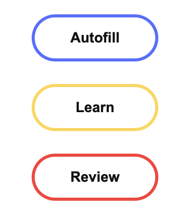

Form Bot
======
It's a Browser extension, help autofill web forms.

How to use it ?
--

There are just three buttons.   
[ Autofill ] : Autofill all the inputs at current web page.  
[ Learn ] : At first time, Form Bot need to learn what you have input. When you finished sort of forms, just click [ Learn ], then they could be autofilled next time.  
[ Review ] : Sometimes, you may be going to update value of a field, or delete some fields.